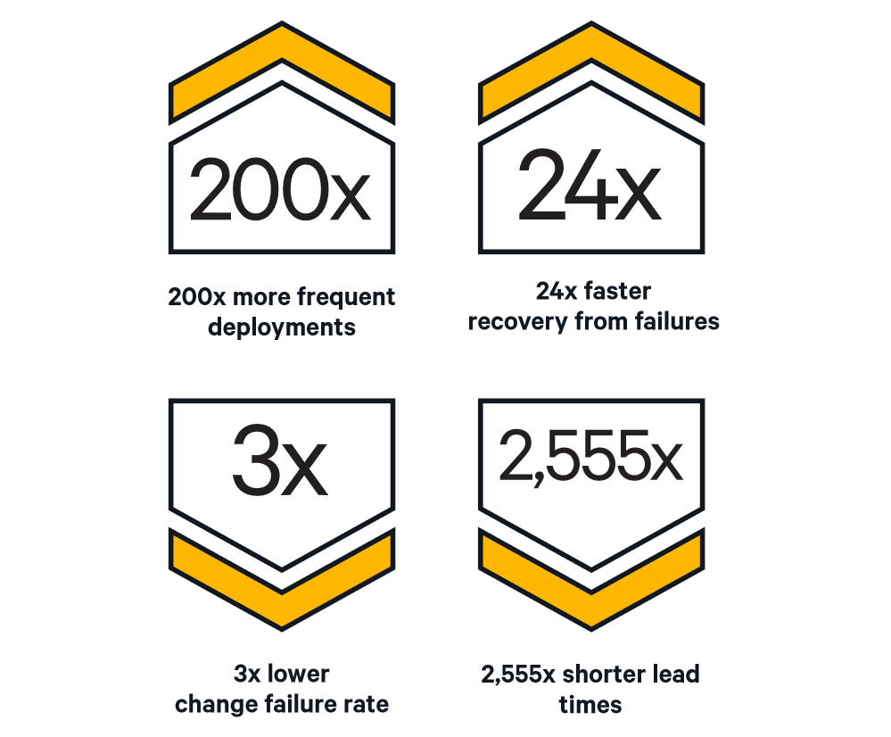

import MarkdownLink from '@site/src/components/MarkdownLink';
import Reference from '@site/src/components/MarkdownLink/Reference';
import EmployeeHopesSvg from './employees-hopes-McKinsey.svg';

I was recently proposed a position as a Senior Software Engineer. Fortunatly, the project was aborted, because there was something hair-raising in the job description: after-hours work deployments. This was not for a startup or a product that rarely gets deployed; I'm talking about a multibillion company that will need to deploy countless times in the future. 

This primitive, obsolete, and outdated approach is how many companies still operate: waiting until nobody can use our platform/service, then deploying it manually.

## Why after-hour deployments are bad?

For two main reasons:
- [Repulsive for the best candidates](#repulsive-for-the-best-candidates)
- [Recurring fees](#recurring-fees)
- [Downtime]

### Repulsive for the best candidates

After the Covid-19 pandemic, [people have more expectation about their working conditions](https://insights-north-america.aon.com/enhancing-wellbeing/changing-expectations-how-the-pandemic-has-affected-what-employees-want-from-their-benefits-programs). For example, [51% of people are hoping for a better work-life balance](https://www.weforum.org/agenda/2021/05/employers-pandemic-covid-19-mental-health/). And they should be: it is the reasonable reality to expect given what technology permits in 2023.

<a href="https://www.mckinsey.com/capabilities/people-and-organizational-performance/our-insights/what-employees-are-saying-about-the-future-of-remote-work">
    <EmployeeHopesSvg />
</a>

I’m sure, as a responsible employer, that you are always searching for ways to improve the work-life balance of your employees, which, in turn, will give you the opportunity to attract the most competent candidates. However, all these efforts from your organization can be thrown out the window if you ask for your employees to do overtime time and time again. Manual deployment is a mentally taxing task for your employees - it drains mental energy without any real contribution to expertise.

You’ll never be able to recruit A-grade employees that way. And if A grade employees avoid your organization, guess what? B-level employees that are looking to improve themselves will lack the guidance they need. What does employees do when they lose their momentum forward? They start looking elsewhere. So you’ll be left with barely average C-grade employees.

### Recurring Fees

Let’s say you need 3 hours of work, every month, with 8 people in the team, to deploy outside of operation hours, with a mean hourly cost of $60 x 1.5 = $80 an hour as it’s overtime.

$80 x 3 hours × 8 employees x 12 deployments/year = $23,000/year.

Now let’s say you have 10 teams that are deploying like that, costs really adds up…

Of course, for some specific situation (POC, MVP, deployments 1–2 times a year, etc.), automated deployment doesn’t make sense. For the rest of the projects, the cost of not doing it is far more important.

Moreover, the more tasks the project requires, the more people you’ll need. With the labor shortage, do you really think it’s a good idea?

### Downtime

Some online services in Canada are still unavailable during certain hours. It makes me 

## What are the advantages of live automated deployments?

### Speed 💨

The best performing organizations are the one that use the latest DevOps deployment techniques. Already in 20151, it was analysed that these organizations have **200x faster lead time** (duration from code commit to code successfully running in production), which led them to deploy **30x more often**. That is the difference between one deployment per month and one deployment per day. Rollback where also a lot quicker: **recovery from failure was 168x faster**.

In 2021, these differences even increased: the top performers had **6570x faster lead time and recovery from failure**, which led them to deploy **973x more frequent code deployments**1.

### Reliability 🙏

As human errors are out of the equation for deployment, the process is a lot safer to execute. With the latest techniques, **High performers were 60x more likely to succeed their deployments in 2015** then low performing organizations.1

Hight performers spend 21% less time on unplanned work and rework, and 44 percent more time on new work Medium performers have a **52% higher re-work time then high performers, which was 32% of their total work**.2 The added reliability of DevOps pratices make top performing team more efficients in their work, and automated deployments are a big step in that direction.

> We are using the term "rework" to encapsulate not only the legitimate reworking of code or infrastructure, but also the kind of unplanned work and rework that come about due to poor processes, system failures and other issues that organizations hope to resolve or reduce by adopting DevOps practices.2

### Team spirit 🙌

> High performers have better employee loyalty, as measured by employee Net Promoter Score (eNPS). Employees in high-performing organizations were 2.2 times more likely to recommend their organization to a friend as a great place to work, and 1.8 times more likely to recommend their team to a friend as a great working environment. Other studies have shown that this is correlated with better business outcomes.2

Live deployments means less pressure, more time to be creative and innovative which, in turn, is attracting for the best candidates.

### Money and profitability 🤑

Faster work, less rework, and less overtime paid means that your accountants will be much more happy about your project then before. On the long run, it could even make a non-profitable project profitable!

### User experience 👌

Some online services are still unavailable during certain hours, which is exasperating in 2023. Live deployments mean that you can keep a 24/7 uptime as they are not impacting availability.

## How to get started?

To deploy live, you’ll need some expertise for the deployment techniques below:

- A [*Blue-Green* deployment](https://docs.aws.amazon.com/whitepapers/latest/overview-deployment-options/bluegreen-deployments.html) is one deployment where you deploy the new version, without any pressure, on a duplicated infrastructure. You have all the time you need to, because guess what? It has zero impact on the real production yet. You can then run all the tests you need directly on the production code. As it is the exact same infrastructure that will be used in production, the replication will me perfect, so you’ll avoid the "it works on my machine" situation. When your tests are done, you just have to redirect your traffic - via a [proxy server](https://en.wikipedia.org/wiki/Proxy_server) - to the new infrastructure. As this step takes literally a few milliseconds, it can be done live without service downtime.

This technique is not even as new as you think. [Martin Fowler wrote, in 2010](https://web.archive.org/web/20100302200004/http://martinfowler.com:80/bliki/BlueGreenDeployment.html) (!):

>  This technique has been "out there" for ages, but I don't see it used as often as it should be.

- A [*Canari* deployment](https://cloud.google.com/deploy/docs/deployment-strategies/canary) is a more advanced technique where you release your new production for a subset of your user base - it can be 1%, 5%, 10%, 25%, whatever you want. Basically, you’re testing the new version from a user standpoint before rolling it out to all users.

Both methods give you the possibility to deploy during operation hours. It you’re new to this, I suggest you start with Blue-Green, as it is easier to implement.

Automated deployments are one of the pillars of [DevOps](https://en.wikipedia.org/wiki/DevOps). If you can’t deploy automatically, you can’t pretend you’re a DevOps team. This is a big cultural shift, yes. But I suggest you calculate the upside of it. How many deployments a year you’re doing? How much does it cost you in overtime work?

<Reference
    id='1'
    to='files/state-of-devops-2015.pdf'
    text='State of DevOps Report, 2015'
/>

<Reference
    id='2'
    author1='A. Brown@https://www.linkedin.com/in/alanna-brown-32baa63/'
    author2='N. Forsgren@https://nicolefv.com/'
    author3='J. Humble@https://www.linkedin.com/in/jez-humble/'
    author4='N. Forsgren@https://www.linkedin.com/in/nigelkersten/'
    author5='G. Kim@https://www.linkedin.com/in/realgenekim/'
    to='files/state-of-devops-2016.pdf'
    text='State of DevOps Report, 2016'
/>

<Reference
    id='3'
    author1='A. Brown'
    author2='& al.'
    to='files/state-of-devops-2017.pdf'
    text='State of DevOps Report, 2017'
/>