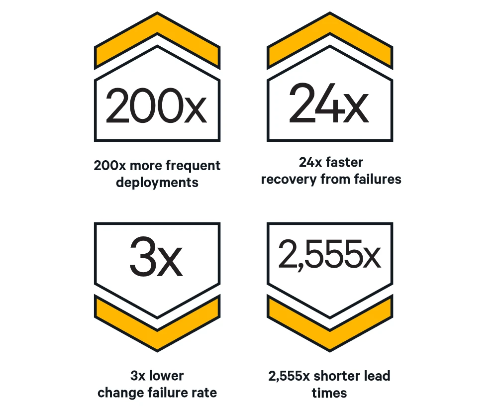
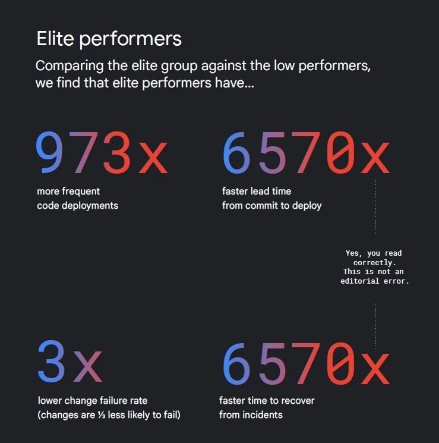
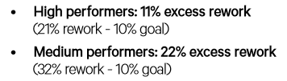
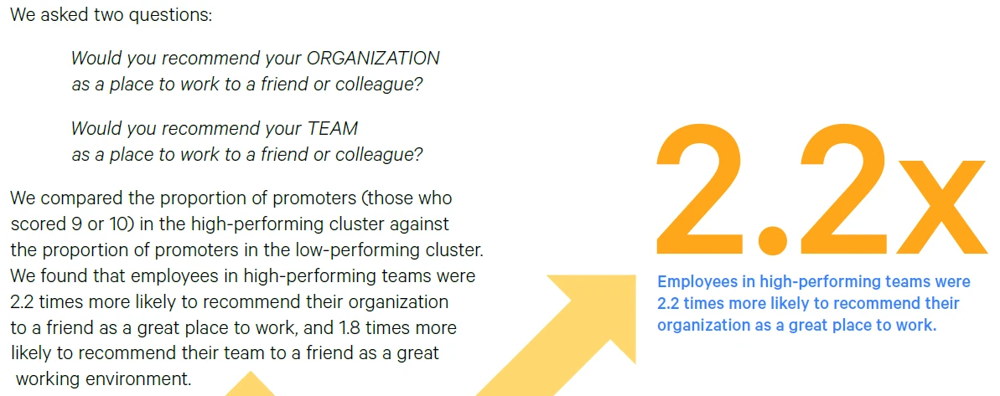

import DevOpsSvg from './DevOps.svg';
import DevOpsVennSvg from './DevOps-venn.svg';
import Reference from '@site/src/components/MarkdownLink/Reference';

## What is DevOps?

In the context of the industrialization era, DevOps can be likened to the assembly line revolution that transformed manufacturing.

Before the assembly line, factories were often disorganized and inefficient. Each worker or group of workers would make different parts of a product in isolation, and then these parts would be put together in a slow and error-prone process. It was like different teams in software development and IT operations working separately.

DevOps, in this analogy, is like introducing an assembly-line approach to software development and IT operations. It's the realization that if you connect and coordinate the work of different teams, just as you would connect different stations along an assembly line, you can produce software more efficiently and with higher quality.

<DevOpsSvg/>

In the industrialization era, the assembly line allowed for faster production, reduced errors, and increased consistency. Similarly, DevOps enables faster software development, better collaboration between developers and operations, and more reliable software releases. It's all about streamlining the process and creating a smoother workflow, just like the assembly line did in the manufacturing world.

In summary, we can say that DevOps is like before and after [Henry's Ford](https://en.wikipedia.org/wiki/Henry_Ford) contribution for the automobile industry.

## How does DevOps Work?

As everyone who worked in software already know, communicating what should software do in proper words is very difficult. Sometimes, the client does not really know what he wants. Often, he knows what he wants, but he doesn't know exactly how he wants it. Sometimes, he knows exactly how he wants it, but he is very limited on how to explain it. 

The [agile manifesto](https://agilemanifesto.org/) was written in 2001. At its core, it was a way to focus the team efforts on the client. The core of the mentality is to show the client the minimal amount of work as possible that will be useful to validate the hypothesis that the client has been understood, and that the developers have the capabilities to deliver what the client wants.

> Our highest priority is to satisfy the customer through early and continuous delivery of valuable software. 
> 
> -- [**Manifesto for Agile Software Development**](https://agilemanifesto.org/iso/en/manifesto.html)

The good news is that now, we have the tools to put agile on steroids.

<DevOpsVennSvg/>

DevOps is like what I call Agile 2.0, in the sense that it is a group of techniques to streamline and automate the process of shipping software into production with the minimal manual tasks as possible.

Twenty years ago, there weren't many commercial tools available to automate the software development cycle. Therefore, an MVP could take a month or two to complete. Nowadays, with modern framework/libraries and a proper structured DevOps stream, it's possible to deploy the same amount of work in under an hour.

## What are the DevOps tools?

First of all, the software deployment cycle can be grouped into three steps:

1. CI: Continuous integration. Here we have the steps of **software build automation** and  **test automation**
1. CD: Coutinuous delivery/deployment. Here we have the deployment automation
1. Operational management, where we monitor the software, requests and adapt infrastructure as needed.

### CI: Continuous integration

## Building the software

Here's where [Jenkins](https://www.jenkins.io/), [GitHub actions](https://docs.github.com/fr/actions), [GitLab](https://docs.gitlab.com/) or [CircleCI](https://circleci.com/) are used. They alloy the automation of packaging the software the way we want. Often they are used in addition to Docker. With Docker, basically, you can choose your configuration (e.g., Ubuntu 22.04, Java 17.0.2). You'll have a "box" running Java 17.0.2 on Ubuntu 22.04, without worrying on the actual OS of the server itself - it's irrelevant now. Your application will see an Ubuntu system, whether or not the OS of your server is Ubuntu, Windows, Linux, Red Hat of others.

Before tools like Jenkins and Docker, basically, you had to:
1. Install your (most likely linux) server (physically of virtually)
1. Install Java on your server
1. Build your software on your (most likely Windows) computer
1. Send a copy of your build on the server

There were a lot of problems back then because the OS and the Java version on your computer were most likely different. You then had to debug the [different behavior between your computer and the server](https://donthitsave.com/comic/2016/07/15/it-works-on-my-computer) This process could take a lot of time.

With automated CI, let's say you want to upgrade to Java 20. You just need to commit (save) your docker file and voilà, the application is building with Java 20. Since you use docker, the execution on your computer or on the server will be identical.

## Automating tests

Before automated tests, you basically had to manually test the software. Because it's very long and tedious, you could do what, 4 or 5 tests before deployments? Now, you can easily do 1000 tests within the same timeframe. It scale the range of testing while multiplying the productivity of the deployment process. Moreover, load testing was impossible to do. You had to ship the software, hope for the best, and adapt: you couldn't plan things in advance.

Nowadays, a lot of products exists for the test automation phase. [It's becoming a job on its own](https://www.indeed.com/career-advice/career-development/sdet).
- Basic/Unit test automation: [Junit](https://junit.org/junit5/) (Java), [PHPUnit](https://phpunit.de/) (PHP), [QUnit](https://qunitjs.com/) (Javascript), [pytest](https://docs.pytest.org/en/7.4.x/) (Python)
- Front-end test automation: [Cypress](https://www.cypress.io/), [HtmlUnit](https://htmlunit.sourceforge.io/), [Selenium](https://www.selenium.dev/) (please avoid this one if you can, you'll thank me later)
- Back-end test automation: [REST-assured](https://rest-assured.io/), [joi](https://joi.dev/api/?v=17.9.1)
- Performance/load test automation: [JMeter](https://jmeter.apache.org/)

While Front-end products are essential for testing Front-End, Backend and performance tests can be done without using dedicated products, but they will help a lot.

A lot of you may ask yourself why I didn't put [Cucumber](https://cucumber.io/) in there: it's because I think it's overrated and frivolous. All that Cucumber do is link a script/function to some text with a layer of Regex. It's possible to achieve the same objectives (connecting the code to proper human language), with a lot less complexity using basic units test tools. You disagree? Let me know why!

### CD: Continuous delivery/deployment

https://www.youtube.com/watch?v=47DQK1wsZgY

### Operational management

This is where scaling management comes in. Let's say Christmas comes and your business receive a lot more requests then usual. This can easily overload the server and make your eCommerce website crash.

<iframe width="420" height="240" src="https://www.youtube.com/embed/47DQK1wsZgY?si=uXo66ciqvQANX5qk" title="YouTube video player" frameborder="0" allow="accelerometer; autoplay; clipboard-write; encrypted-media; gyroscope; picture-in-picture; web-share" allowfullscreen></iframe>

Kuburnetes can resolve this problem by starting more containers (or servers, if we oversimplify) dynamically when the load increase, and shutting down capacity when the people leave your virtual store. Convenient, isn't it?

Also, monitoring services (like [ELK](https://www.elastic.co/)/[Logstash](https://www.elastic.co/logstash), [Graphana](https://grafana.com/), [Datadog](https://docs.datadoghq.com/)) can help the team at this step to analyse the software problems and load requirements patterns of the application over time to improve the software as time goes. Let's say a lot of users have trouble logging in because the Front-End is not user friendly. Monitoring can detect this problem (lots of user fail to login) and then be proactive about it, instead of waiting for complaints from users and the client.

## What are the advantages of DevOps?

### Speed 💨

The best performing organizations are the one that uses the latest DevOps deployment techniques. The results are mind-blowing: already in 2015[1](#reference-1), it was analyzed that these organizations have **200x faster lead time** (duration from code commit to code successfully running in production), which led them to deploy **30x more often**. That is the difference between one deployment per month and one deployment per day. Rollback where also a lot quicker: **recovery from failure was 168x faster**.

The differences even increased over time, like compounded interests.

In 2016, the top performers had **2555x faster lead time**, which led them to deploy **200x more frequent code deployments**[2](#reference-2)

In 2021, the top performers had **6570x faster lead time**, which led them to deploy **973x more frequent code deployments**[3](#reference-3).

An increase in speed can be attributed to the following factors:
1. [Automated deployments](/blog/2023/09/06/After-hours-work-is-a-red-flag/)
1. Automated tests
1. Improved efficiency. **High performers spend 21% less time on unplanned work/rework, and 44 percent more time on new work**.[1](#reference-1)

> We are using the term "rework" to encapsulate not only the legitimate reworking of code or infrastructure, but also the kind of unplanned work and rework that come about due to poor processes, system failures and other issues that organizations hope to resolve or reduce by adopting DevOps practices.[2](#reference-2)

### Reliability 🙏

> We have debunked the myth that we need to choose between speed and reliability[1](#reference-1)

As human errors are out of the equation for deployment, the process is a lot safer to execute. With the latest techniques, **high performers were 60x more likely to succeed in their deployments in 2015** than low-performing organizations.[2](#reference-2)

Sometimes, faster does not mean more dangerous. Think of high-performing quality brakes on a race car. The brakes will make the car safer, but will also alloy the driver to break harder and later before each corner. That means faster lap times as well. Test automation is one area where big gains for both productivity and reliability can occur at the same time.

### Better employees 🙌

> High performers have better employee loyalty, as measured by employee Net Promoter Score (eNPS). Employees in high-performing organizations were 2.2 times more likely to recommend their organization to a friend as a great place to work, and 1.8 times more likely to recommend their team to a friend as a great working environment. Other studies have shown that this is correlated with better business outcomes.[2](#reference-2)

### Money and profitability 🤑

Faster work, less rework, and less overtime paid means that your accountants will be much happier about your project than before. On the long run, it could even make a non-profitable project profitable. 

At a 6000x+ speed difference between the best and the worst organizations, we can agree that it opens up a lot of doors for the best performers. With the same revenues, a top performer will turn a 1000x bigger project profitable where a worst performer will bankrupt the project.

Let that sink in.

This is not just a theoretical advantage: a top DevOps performer was linked to a **50% faster increase in market capitalization**:

>In a follow-up survey last year, we gathered stock ticker data and performed additional analysis on responses from just over 1,000 people who volunteered the names of the companies where they worked, and whose companies are publicly traded. We found that these people were from 355 companies, and they all outperformed the S&P 500 over a three-year period. The publicly traded companies that had high-performing IT teams had 50 percent higher market capitalization growth over three years than those with low-performing IT organizations[1](#reference-1)

<Reference
    id='1'
    to='files/state-of-devops-2015.pdf'
    text='State of DevOps Report, 2015'
/>

<Reference
    id='2'
    author1='A. Brown@https://www.linkedin.com/in/alanna-brown-32baa63/'
    author2='N. Forsgren@https://nicolefv.com/'
    author3='J. Humble@https://www.linkedin.com/in/jez-humble/'
    author4='N. Forsgren@https://www.linkedin.com/in/nigelkersten/'
    author5='G. Kim@https://www.linkedin.com/in/realgenekim/'
    to='files/state-of-devops-2016.pdf'
    text='State of DevOps Report, 2016'
/>

<Reference
    id='3'
    author1='D. Smith@https://www.linkedin.com/in/dustin-smith-b0525458/'
    author2='D. Villalba@https://www.linkedin.com/in/daniella-villalba-34633a186/'
    author3='M. Irvine'
    author4='Dave Stanke@https://www.linkedin.com/in/davidstanke/'
    author5='N. Harvey@https://www.linkedin.com/in/nathen/'
    to='files/state-of-devops-2021.pdf'
    text='State of DevOps 2021'
/>

 

F1 photography by [Colin Whittaker](https://www.flickr.com/photos/cewhittaker/7381515496), [CC BY 2.0](https://creativecommons.org/licenses/by/2.0/)