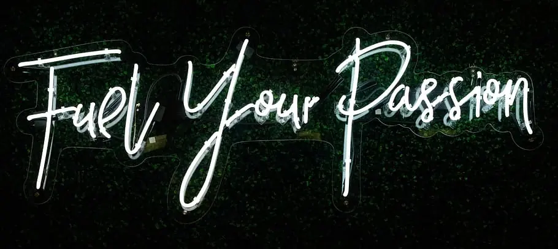

import '@justinribeiro/lite-youtube';

I was listening [to a podcast featuring my friend Olivier Jean](https://livingrichly.me/the-champion-mindset/), gold medalist during the 2010 Olympics in Vancouver. Towards the end, the host asked him a question that gets asked a lot: How do I find my passion? How do I maintain it enough so I can keep going on?

<lite-youtube 
    videoid="6bttHdNJIcs"
    videoStartAt="1809"
    videotitle="Olympic Champion Olivier Jean get asked how to find your passion"
/>

Having dedicated my life to speed skating for 15 years - I can relate to that feeling of being lost after a big journey that was ended. Especially between the years 2014 to 2020, it was a very challenging time for me. Looking back now, I definitely had a depression or some sort of existential crisis at one point.

In that time I tried a lot to find answers. Since I read a lot about that topic, I'd like to write what I understand on the topic, and what worked for myself.

First, a bit of theory. [Based on psychology papers, there are two types of passion](https://www.sciencedirect.com/science/article/abs/pii/S1469029217300705?via%3Dihub):
- Harmonious passion
- Obsessive passion

### Harmonious passion

Harmonious passion is an internal one: you're motivated about practicing an activity because it brings you joy. Here we seek progress for itself: we want to progress just for the energy it brings you back after a great session.

It is based on a paying mindset. We pursue it just because we feel better doing it, and we are more mentally energized after it than before.

People that are more into harmonious passion tend to identify themself as participants of a bigger thing. They will say: "I'm a cyclist." "I'm a hockey player."

Harmonious passion is often viewed as childist or superficial, and I'll never be able to say enough how wrong this is. Harmonious passion is the one that will keep you going when you keep improving but you can't get results. Let's say you're running with the intention in beating [Eliud Kipchoge](https://fr.wikipedia.org/wiki/Eliud_Kipchoge) in the next Marathon World Championships. Sound ridiculous, isn't it?

You can enjoy yourself the activity for itself, for your own progress. You'll be very happy about your results in you retract 10 minutes on your marathon time, for example. That's harmonious passion. 

It's the most sustainable passion because you can't always win. In fact, even elite athletes loose more then they win. [Novak Djokovic, since his first grand slam in 2008, has not won the grand slam tournament 56% of the time](https://en.wikipedia.org/wiki/Novak_Djokovic_career_statistics) - and I'm talking here about one of the most dominant athlete of all time.

With hamonious passion, as your focus is to play, people will be happy to practice with you, so it's the passion that will keep you engaged with your teammates, coaches, mentors, colleagues or coworkers.

[Firas Zahabi](https://en.wikipedia.org/wiki/Firas_Zahabi), head coach of [Georges St-Pierre](https://en.wikipedia.org/wiki/Georges_St-Pierre), said at the Joe Rogan podcast that it's a joy to spare with him because he's having a lot of fun during his training. He's not trying to crush everyone to show that he's the best: that is for the fight night only. That relaxed attitude is an important factor on why he's been able to train with a lot of talented athletes all over the world, but also a factor on why he's still so healthy today, physically and mentally.

<lite-youtube
    videoid="_fbCcWyYthQ"
    videotitle="How to workout smarter by Firas Zahabi, head coach of Georges St-Pierre"
/>

I can personally give yourself a good exemple of harmonious passion that I experienced last summer.

First karting race of the season 2023, I was absolutely flying during the race, well challenging the top ten racers. I was so fast I could make driving mistakes and catch up with the front runners, which shouldn't happen. I learned I was the third fastest on the track at that specific moment.

Then another racer hit me from behind during a fast corner. My race was over.

My reaction? I was so happy. Not about the crash, but about my weekend. I was able to extract more speed than my last race at the same track - and it was already my best track ever based on results.

I didn't care about the end result - I was happy about my improvement. It motivated even more for the upcoming races. That is the sign of a solid harmonious passion.

### Obsessive passion

Obsessive passion is linked to outside stimuli. If you're motivated about money, medals, winning, success, getting famous, etc. - You're in that category. It is based on what you have to gain from society to you. It is based on a "work" mindset. As you're not doing something for itself but for what has to be gained from it, it is linked to perseverance, tenacity. People with obsessive passion will tend to continue even if the practice of the activity has negative consequences in their lives. People more into obsessive passion will also tend to confound their own value with their results - they will see themselves as champions or losers. You can understand how's that mental rollercoaster is very hard on the mental side.

Here's some talk associated with obsessive passion:
- "No pain, no gain"
- "This is serious"
- "If we wanted to have fun, we would have gone skiing" 

Too much obsessive passion can be detrimental for the well-being, so you have to make sure that your harmonious passion - which is positive for your well-being - is strong enough on to support your mental health if you want to crank up obsessive passion. Otherwise, you'll be trading performance at the cost of mental health. It can work on the short term, but you'll blow up eventually.

In summary, to build yourself a model, you need to:
1. Know yourself first
1. Find an activity that matches your personality
1. Implement a good strategy for improvement

## 1. Know yourself first

How does your brain - your personality and your emotions - work?

If you are a Myers-Briggs personality test believer here, sorry, but Myers-briggs test is scientific junk.

<lite-youtube 
    videoid="_TGdzGIvcRs"
    videoStartAt="7319"
    videotitle="Dr. Ali Mattu explains that Myers-Briggs personality test is scientific junk"
/>

<lite-youtube
    videoid="Q5pggDCnt5M"
    videoStartAt="Vox explains the problems with the Myers-Briggs personality test"
/>

The most advanced scientific model for personality is the [Big 5 Personality model](https://www.verywellmind.com/the-big-five-personality-dimensions-2795422). 

Basically, there are five dimensions or spectrums to someone's personality:
1. Extraversion, the degree of how much someone gains energy from social interactions
1. Neuroticism, the degree of how much someone tends to experience negative emotions
1. Conscientiousness, the degree of how someone tends naturally to execute the tasks they are supposed to do
1. Agreeableness, the degree of how much someone tends to pleasure other people
1. Openness, the degree of brain ability to link between concepts or think about abstract ideas.

Knowing yourself is critical,  because it will predict how's a particular activity is correlated to improved mood on yourself.

## 2. Find an activity that matches your personality

For example, lower than average agreeableness people should seek competitions. It's an activity that will reward only the best ones. As less agreeable people tend to think in a selfish "What's in it for me" way, a competition is a great carrot for them.

People high in openness will be well fulfilled in activities with high creativity involved (arts, engineering). Basically, any type of activity where you need to think outside the box will be a good fit for them.

If you're very high in extraversion, you should choose something where you'll encounter a lot of people (like event organization or sales). If you're more of an introvert, you might find individual activities more enjoyable.

Personally, I have
- A very high openness (I like to find new solutions, discuss complex problems). That's why I love engineering, science and philosophy.
- Over then average conscientiousness (When I have an idea, I'm very prone to work on it until I realize my goal)
- Over then average extraversion - I need to see people to refill my energy levels
- Lower than average agreeableness (I love competition) and neuroticism (I stay calm even in stressful situations). This is a perfect match for my sports that are dangerous racing sports - Short track speed skating, Cycling and Karting.

## 3. Have a good strategy for improvement

### Build yourself a passion model.

Based on your personality, you need to find the right balance of harmonious passion and obsessive passion. Since everyone is different, I think everyone has to build their own passion model - and that is what is so difficult about it. For example, I would hypothesize that someone with high neuroticism won't be able to stack as much obsessive passion as someone with low neuroticism. That's a journey you have to do yourself, as both passion types have their strengths.

Harmonious passion is a great foundation for success, because you will crave the practice of the activity naturally. Without harmonious passion, you'll never be able to be in the flow - a mental state where you're so immersed into the task that everything else disappears. The flow will make you experience your greatest level of performance at that specific moment. To be in it, you have to be detached from the outcome: that means not thinking about your result.

However, this is a fragile passion as it will disappear when no progress is occurring. "Progress" here is defined on whatever you gain internally from it (competency, health, great friends). 

Let's say you're in a three-month-long training phase and you don't have any way to see if you're making progress yet. You don't know if you're getting better, you don't feel if your health is better, and you have to train alone. This is what is happening to me during the winter months while I train my cycling on Zwift. It is then very difficult to rely on harmonious passion during this 3-month period because harmonious passion will just die. So I just discipline myself, even if the results are not perceptible. And to discipline myself, I'm constantly tinking about my upcoming races I'd like to win.

I won't necessarily win, I'm aware of this. I continue training in the winter even if I'm not enjoying it - this is because I know this is temporary and I know my level will eventually rise when I am able to cycle outdoors again. When that happens, seeing the results, my harmonious passion explodes in joy, even if I didn't win - just seeing my improvement is enough.

Obsessive passion greatest strength is to fill the gaps when the harmonious passion is gone. As it is the passion associated with outside stimulus, it will make you practice even when you're not feeling it as you *want* that result. When you have to discipline yourself, this is the type of passion that will keep you on track. 

Harmonious passion will come back to even greater levels when you improve yourself. Improvement is essential, though: this is why having a working training plan is absolutely essential. Relying on obsessive passion temporarily will work as long as you're getting results at the end. Otherwise, you'll be disgusted that all this work was done for nothing - and it's very likely that you will give up.

### Have a pragmatic (and efficient) plan

Listen to wise people. Have a (good) coach if you can. They will prevent you from deadly traps. If you fall into a hole (making a mistake that stops your progress), you may never recover.

The thing I learned while reading Guillaume Delude "I am a gold digger" book is that progress is the fuel you need for further practice. See, the brain knows how limited your energy supply is. He doesn't want you to waste your energy for something that's bad for you. If your brain sense that you put energy that doesn't come back one way or another (by making progress, social interaction, etc.), you will eventually lose interest for that activity. If you ignore your brain and still try to push too hard, you're on the path of depression or burnout.

You need to figure out a way to build yourself a virtuous cycle. Where practice brings you motivating progress, like having a good financial investment. This increased motivation will lead you to practice more. That increased practice will lead to even bigger results.

To build the circle, it's absolutely critical that the actions you take are good one and not lost energy. This is where quotes like "No pain, no gain" can be toxic. The mentality is great if it's balanced and if you already have a working strategy, but otherwise, you will burn yourself.

The nuance between positive and toxic perseverance? The profitability of your efforts. If you progress, it's positive. If you put in a lot and you're stagnating, it's becoming toxic.

The same way people are sometimes in toxic relationships because it gives them short bursts of intense euphoria, you can also have toxic passions (overly obsessive ones). Passion can burn you, whether it is for someone or for an activity.

## Build your passions, plural

"Finding your passion" is a bit misleading, because it's a process you mainly need to build, opposed as discovered, the same way that you build love over time in a healthy relationship.

Finally, I want to emphasize that after you become good at building these virtuous cycles, you can build multiple passions at the same time. Passion doesn't mean you can't have two, or three, or four! It's up to you how many you want.

When you understand the process, you have laid out the foundation of happiness in every aspect of your life: in love, for your family, at work, for your hobbies, and more.

## Good reads  on the topic

- [Je suis un chercheur d'or: Les mécanismes de la communication et des relations humaines](https://www.amazon.ca/-/fr/Guillaume-Dulude/dp/2761950054) - French

- [Champion dans la tête: Comprendre et s'inspirer de la psychologie des champions](https://www.amazon.ca/Champion-dans-t%C3%AAte-Comprendre-psychologie/dp/2761946480/ref=sr_1_1?crid=L5J7MW04OC3F&keywords=champion+dans+la+t%C3%AAte&qid=1694203556&s=books&sprefix=champion+dans+la+t%C3%AAt%2Cstripbooks%2C102&sr=1-1) - French

- [The Motivation Myth: How High Achievers Really Set Themselves Up to Win](https://www.amazon.ca/Motivation-Myth-Achievers-Really-Themselves/dp/0399563768)

- [So Good They Can't Ignore You](https://www.amazon.ca/Good-They-Cant-Ignore-You/)