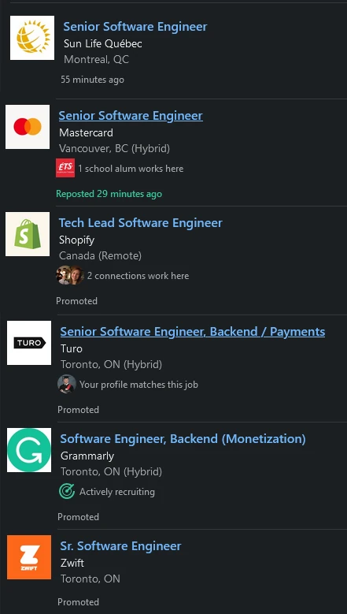

Here's the description of a job I was offered recently:

> SDETs:  Typescript / Cypress.io, JMeter (performance testing), Selenium.  Used to working as automation engineers in stride with development.

Problem with that? Contrary to the U.S., [the Engineer term is strictly regulated in Canada](https://engineerscanada.ca/become-an-engineer/use-of-professional-title-and-designations). If you call yourself an engineer, you risk fine and injunctions.

## Engineer term in the US

In the U.S., "engineer" is more loosely used, in the sense that it can be included in a job title name. On November 18, 2022, the [IEEE](https://ieeeusa.org/) - [Institute of Electrical and Electronics Engineers](https://fr.wikipedia.org/wiki/Institute_of_Electrical_and_Electronics_Engineers) - published a [position statement where they clarified the use of the Engineer title in job description](https://ieeeusa.org/assets/public-policy/positions/workforce/EngineerTitle1122.pdf):

> Generally, the public interprets the term, “Engineer,” more broadly than is represented by the protected titles. […] It is the IEEE-USA position that:

> Individuals who have graduated with an engineering degree from an ABET/EAC accredited program of engineering education should not be prohibited from using the title “Engineer.”

> The protected titles “Professional Engineer,” “Licensed Engineer,” “Registered Engineer,” and variations thereof, should be reserved for those whose education and experience qualify them to practice in a manner that protects public health, safety and welfare -- and who have been licensed to practice engineering by a jurisdiction.

The leading software companies are in the U.S. The term Enginner is used widely there to clearly state the conceptual and implementing challenge of the job:

- Software engineer
- Data engineer
- Automation engineer
- SDET (Software Developer Engineer in Test)
- DevOps Engineer

## Engineer term in Canada

In Canada, the term "Engineer" is strictly prohibited, even from engineering graduates.

> **Job postings**: Advertising an engineering related job without requiring licensure from the engineering regulator in the province or territory where the work will be taking place may have legal implications. Requiring eligibility for licensure in the job posting is a a first step, but the newly hired person must be licensed before practicing engineering.

Fun observation, a simple search on LinkedIn proves that it doesn't prevent companies from posting "Engineering" roles.

It prevents people from using the official job posting of the company in their own resume and online profiles. Hypothetically, what happens if they want to publicize this experience to apply for a U.S.-based job? Are they allowed to use the term Engineer then because it implies a different regulation? What if a Canadian citizen goes in the U.S. for a couple of years to work as a Software Enginner role and then comes back to Canada? Is he allowed to use that job title, since his past experience was in the US? 

## Misconceptions on expertise

### Data Enginner/Data Analyst

As the term is strictly regulated in Canada, the job title often gets wrote as an alternative term. For example, to replace the "Data Engineer" title, engineerscanada recommends the term "Data Analyst" as the first replacement choice.

Problem with that? As they are not the same job, [someone doing data engineering will most likely be misinterpreted as someone doing Data Analysis](https://www.springboard.com/blog/data-science/data-engineer-vs-data-analyst/), which will get misconceptions from the hiring teams.

> Is There a Difference Between a Data Engineer and a Data Analyst?
>
> Yes. A data analyst combs through quantitative data to glean patterns and report them for strategic decision-making. A Data engineer, on the other hand, formulates tools to help with data transfer, data analysis, and other workflows that are peripheral to the actual data itself.

### SDET/QA

Another example is the term [SDET - Software Development Engineer in Test](https://www.softwaretestinghelp.com/what-is-sdet/). I was personally executed multiple SDET roles in my last jobs, [including a SDET Tech Lead mandate](/docs/experiences/sdet-technical-lead-at-national-bank-of-canada). My job was pretty much the same as that of a Software Development Tech lead: I was performing conception, design, technical leadership/optimization, coding, deployments, and training for my team.

However, because SDET term may have legal consequences in Canada, I often get referred as a "QA". [A QA often refers to someone manually testing software](https://www.softwaretestinghelp.com/what-is-sdet/#:~:text=QA%20tester%20would%20just%20use%20the%20Application/System%20under%20test%20as%20any%20normal%20user/customer%20would%20use).

> QA tester would just use the Application/System under test as any normal user/customer would use but with a focus on more minute details as well as edge scenarios by trying different input combinations, etc.

Because my last role is often put in then QA bucket, I currently have several marketing problems:

1. Following my SDET technical lead mandate, I keep getting invitations for manual QA roles, which I keep refusing.
2. Some people interpret my refusals as a no-go for all QA roles, which is a shame because it all depends on the mandate: some QA mandates (as they won't be called SDET) are conceptually challenging and therefore well suited for me. Some people also interpret SDET and QA as synonyms. QA is a department or a role, but it's **not a job profile or job title** like SDET is. A proper job title would be "Manual tester" or "QA Operator".
3. Having done several SDET mandates, I sometimes get refused by some companies that don't properly read my resume and think I lack technical capabilities for a developer position. This is ironic, because a Software Development Engineer in Test requires expertise on top of the Software Development skills.

## Court case: APEGA vs Jobber (Octopusapp Inc)

A [current court case may precisely rules on the use of the Engineer term within the software industry](https://www.theglobeandmail.com/business/technology/article-is-a-software-engineer-an-engineer-alberta-regulator-says-no-riling-2/).

> The Association of Professional Engineers and Geoscientists of Alberta (APEGA), has asked a court to order one of the province’s leading software companies, Octopusapp Inc., known as Jobber, to stop using the term “engineer” in job titles and postings unless it gets a permit from the regulator.

> That has caused an uproar in Alberta’s tech sector. On Friday, the Council of Canadian Innovators (CCI) published an open letter signed by chief executive officers of 32 Alberta tech companies, including Jobber’s Sam Pillar, calling on Premier Danielle Smith to stop “regulator overreach” by APEGA.

> “The term ‘engineer’ has been used in software for decades,” said Dax Dasilva, executive chairman of Montreal’s Lightspeed Commerce Inc. “I don’t believe more regulation around terminology is suddenly necessary.”

While I don't agree with the word "overreach" here - this is not an additional regulation; the APEGA just applies the rules of Canada as they've always been - I agree 100% with the fact that we should synchronize our regulation with the U.S.

## Remote American jobs as the next Northvolt?

Governments are very proud of local, cutting-edge technological jobs. [My local governments just announced up to 7,3 billion dollars in investment for a battery mega-factory](https://www.bnnbloomberg.ca/northvolt-gets-billions-from-canada-to-build-quebec-ev-battery-plant-1.1977685). That factory should create 3000 well-paid jobs. Per job, that's an investment of... 2.5 million dollars. Profitability will be far, far away...

To create 3,000 well-paying jobs, can we do better? [Canada has around 10,000 software creators](https://www150.statcan.gc.ca/t1/tbl1/en/tv.action?pid=9810040401&pickMembers%5B0%5D=1.1&pickMembers%5B1%5D=2.1&pickMembers%5B2%5D=3.4&pickMembers%5B3%5D=4.20). With the labor quality being equal, and as the cost of living is way cheaper in Canada than in the U.S., I wouldn't be surprised if the U.S. tech industry were interested in engaging thousands of remote workers from Canada in the next years.

However, the current mismatch between the Engineer term is a setback for Canadians as they can't publicize themself as "Enginner" on LinkedIn. They won't appear in "Software Engineer" searches from job hunters. It's unfortunate because it's the most accurate job title for any software generalist builder that can tackle all tasks from the client's requirement to maintenance and all the steps in between.

## Conclusion

The reserved engineering term made sense at the time. I want my local authorities to have the power to forbid someone to build a bridge, a plane, or a car if they don't respect the safety of people. That was the goal. With that said, I have trouble understanding how permitting someone calling himself a "Software Engineer" will threaten public security.

Having a required "P. Eng." for any job that pose a risk for human safety like in the U.S. would be a good compromise. You write software for a production self-driving car? You'd be required to be P. Eng. Otherwise, simply requiring an Engineering degree to use the word "Engineer" would be fair to me.

Also, in a world where Banks and payment methods rely more heavily on software every year, where financial institutions can be affected with [data theft that affects 4,200,000 people](https://www.cbc.ca/news/canada/montreal/desjardins-data-breach-1.5344216), I would like to see more Software engineering jobs requiring the P. Eng. title. I also hypothesize that P. Eng. obligation could be better when sensitive data is managed like [when storing social security numbers](https://www.reddit.com/r/webdev/comments/6bzicz/best_practice_for_storing_ssn/), or for the software built for telecommunication networks. Remember the [2022 Rogers Communications outage](https://en.wikipedia.org/wiki/2022_Rogers_Communications_outage)?