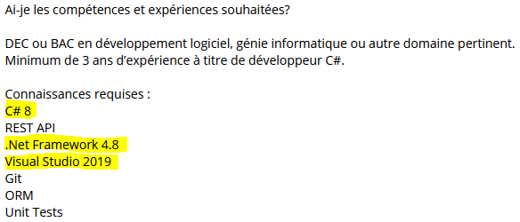

import { TwitterTweetEmbed } from 'react-twitter-embed';

Earlier this year, I was browsing Reddit when I saw a post on [r/ProgrammerHumor](https://www.reddit.com/r/ProgrammerHumor/). [The post](https://www.reddit.com/r/ProgrammerHumor/comments/knzivk/first_meme/) was a *meme* of [u/J-Ax22](https://www.reddit.com/user/J-Ax22/) which shows a typical situation of an IT recruiter… who knows nothing about technology.

Several typical problems are indeed noted by developers.

<TwitterTweetEmbed
  tweetId={'1683066324166103040'}
/>

Examples?

### Unrealistic work experience: 8 years of experience in *Kotlin*

The *meme* above refers to exactly this kind of situation. [Kotlin programming language was launched in 2016](https://en.wikipedia.org/wiki/Kotlin_(programming_language)). Therefore, an experience of 8 years in this language is impossible. This indicates that the recruiter did not take the trouble to write his offer in line with the reality of the market.

Another example? [Sebastián Ramírez](https://tiangolo.com/) who sees a job application asking for 4 years of experience in *FastApi*... even though he created this technology himself barely 1.5 years before!

<TwitterTweetEmbed
  tweetId={'1281946592459853830'}
/>

### A Confusing Job Posting: *Front-end Full-stack Developer*

It's an offer that I personally received in a private message on LinkedIn.

What do we mean here?
* If the offer is mainly for *Front-end*. In this case, a *Full-Stack* programmer will quickly feel limited in his challenges, while lacking expertise for the more advanced aspects of the *Front-End*.
* If the work was really *Full-stack*, we should have simply put this term. A *Full-Stack* job indicates that the developer will be responsible for the *Back-End* up to the application's user interface. An emphasis on the term *Front-end* casts doubt on the *Back-End* tasks that the developer will have to perform… will there really be any?
* The fact that the two terms are put side by side perhaps indicates a misunderstanding by the recruiter, which does not smell good

At first glance, it is a company that does not seem to assume its strategy not in the description of the roles. With my experience, I know all too well the bad practice of a company wanting to hire "day laborers" who can do everything. I also wrote about the dangers of this strategy in the post [*Hire a developer: generalist or specialist?*](/generaliste_ou_specialiste)

The problem is then to expect the performance of specialists. The danger of hiring too broadly is having inflated expectations of what a generalist can do. A team of two specialists - for example, an excellent specialist *Front-End* developer with a specialist *Back-End* developer - will be much more efficient and effective than a team of two *Full-Stack* developers.

### Too much precision: C# 8, .NET Framework 4.8, Visual Studio 2019

Conversely, some job offers are so specific that it greatly limits the number of potential candidates. Errors at this level:

* Paying too much attention to a programming language. [Programming languages, there are hundreds](https://careerkarma.com/blog/how-many-coding-languages-are-there/). It would be silly to do without the best candidate because, for example, this candidate knows Java and the position is for `C#`. The fact is that the programming language, very often, has little bearing on the work of the developer. A good generalist will be fully operational in a few weeks with a language similar to his experience. For example, switching from `Java` to `C#` is very easy given the similarities between the two languages.

* List, down to the version of the code editor, the prerequisites for the job. If it's possible for a developer to go from `Java` to `C#` in a matter of weeks, imagine how long it will take to get used to a particular version of a language. For example, requiring `Java 11` when the candidate is a senior developer in `Java 8` is to refuse an excellent candidate because the company they worked for most likely had constraints that prevented them from using `Java 11`. When the code editor is even more exaggerated. If I have experience in Visual Studio 2015 rather than 2019, am I disqualified? 

It is obvious that a good candidate should apply for such an offer if he understands the general aspect of the message. It would be a shame to deprive yourself of a discussion with the company for such a detail.

However, it is a detail that should be considered as such by the recruiter. Having it qualified casts doubt on the judgment of this company, which, based on this ad alone, seems rigid and bureaucratic. Sensing this gap with the market, an excellent candidate could then pass his turn.

### An offer that asks for the moon

[Michael O'Donnell made a LinkedIn post of it in 2018.](https://www.linkedin.com/pulse/ridiculous-job-descriptions-chase-away-some-best-michael-o-donnell/). In summary, some offers are so long that they are simply ridiculous considering the salary and the position offered.

In IT, we can observe this phenomenon when consulting certain classified ads: knowledge of more than ten languages, 5 to 10 years of experience with several programming languages. How is it possible?

### Interresting points:

* The "years of experience by language" hierarchy is flawed, as the best candidates can be penalized by it. They will learn a language faster, and will deliver the product before the average developer. Moreover, as reduced maintenance is needed (better developpers write fewer bugs), they will spend less time on that, too. They are more likely to jump on another project, using another language.

* Junior, Intermediate and Senior developpers are very loosy terms, as there's no subjective way of measuring it.

* Asking a design specialist deep technical questions or to resolve language-dependant exercices is irrelevent. 

* [Creativity is impacted negatively under stress](https://hbr.org/2002/08/creativity-under-the-gun). Why are we still doing whiteboard interviews?

### Questions to ask yourself as a recruiter

* **What is my definition of "programming experience"?** If I do `Java` for two weeks to fix a bug, does the total year count in those "years of experience"? If I work 1 year in java, then I take a year break, and I come back with another year in Java (learning the new features of the language), is that the equivalent of 3 years? A Senior JavaScript (Node.js) micro-service developer who learns Java 11 in 1 month, can he claim that he has the equivalent of 10 years of Java micro-service programming experience?

* **What type of employee do we need for the mandate?** A design specialist (e.g. a microservices expert) is very different from a language specialist. A designer is an expert at building structures to resolve context-specific problems, while a language specialist will be needed when you need to maintain an already existant code base or to optimize an existent product. Some designer can do both, but it's a lot harder for a language specialist to do the former.

* **How can I make sure the candidate will be a good fit?** A chit-chat conversation won't give you much relevent informations. It will give you the insight of emotional connection. You'll be able to tell if this person's personality would be a match to be a good friend of yours, but it will be very limited on the profesionnal compatibility of the candidate.

### The best recruitment technique: real work!

Let's say you start to have interviews with interresting candidates. Wait until you find several candidates. Ask them to perform a small project that would be relevent to the context of the project and give them severals days to do the work. Require them to present the work to the team after.

This is how [David Heinemeier Hansson is doing to hire people at bootcamp](https://m.signalvnoise.com/hiring-programmers-with-a-take-home-test/).

This technique has a lot of benefits:
1. You will eveluate them on their real work productivity, with access to modern tools (internet) that they will have access in their work environment anyway
1. As software development is understanding the context inasmuch as writing good code, you will be able to screen out the candidates that are selling their coding expertise without being able to be grounded on the actual problem
1. You are removing the pressure variable from the equation
1. You will be evaluating them on their communication skills when they will present their work to you
1. As the candidates will interact with the team, you will be able to ask for their input on who they prefer to work with